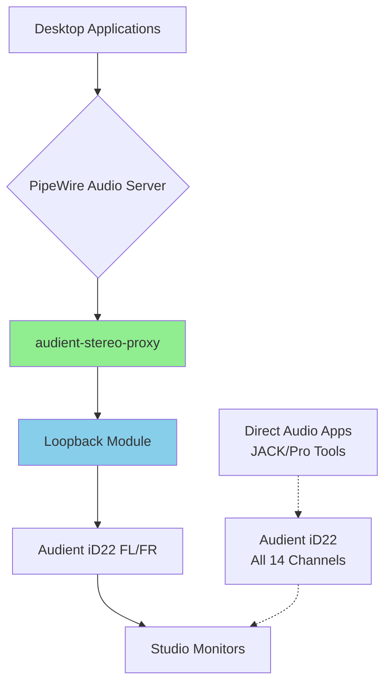

# Audio Configuration Guide

Complete guide for configuring professional audio interfaces with PipeWire on this system.

## Overview

This dotfiles repository supports **host-specific** audio routing configurations for professional audio interfaces.

**Important**: Audio configurations are **per-host**, not global. Each host can have its own audio setup based on available hardware.

## System Architecture



## Configuration Files

### Host-Specific Structure

Audio configurations are stored per-host:

```
hosts/
├── dragon/                          # Desktop with Audient iD22
│   └── pipewire/
│       ├── 20-stereo-audient.conf   # Stereo proxy loopback
│       ├── 90-audient-defaults.conf # Default sink/source
│       └── README.md                 # Host-specific docs
├── firedragon/                      # Laptop (no permanent interface)
│   └── (no pipewire directory)      # Uses system defaults
└── ...
```

### Dragon Host Files

| File | Purpose | When Loaded |
|------|---------|-------------|
| `20-stereo-audient.conf` | Creates stereo proxy sink | PipeWire startup |
| `90-audient-defaults.conf` | Sets default audio devices | After all other configs |

**Note**: Other hosts without custom audio configs will use system defaults.

## Installation

### Automatic (Recommended)

For the **dragon** host, audio is configured automatically during setup:

```bash
cd ~/dotfiles
./install.sh --host dragon
# or
cd hosts/dragon && ./setup.sh
```

### Manual Installation

```bash
# 1. Run audio setup script (auto-detects host and configs)
~/dotfiles/scripts/utilities/audio-setup.sh

# 2. Verify configuration
~/dotfiles/scripts/utilities/audio-setup.sh --status
```

**Note**: The script automatically detects:
- Current hostname
- Whether host has custom audio configs
- What hardware is connected

## Configuration Details

### Stereo Proxy (20-stereo-audient.conf)

Creates a virtual stereo sink that simplifies multi-channel interface routing:

```conf
# Virtual Sink: audient-stereo-proxy
# → Routes to: Audient iD22 Front-Left/Front-Right
# Purpose: Simplifies desktop audio routing
```

**Why This Matters**:
- Professional audio interfaces often have 8-14+ channels
- Desktop apps expect simple stereo output
- Games/browsers can get confused by multi-channel devices
- This creates a "standard stereo device" that routes correctly

### Defaults Configuration (90-audient-defaults.conf)

Sets system-wide audio defaults:

```conf
# Default Sink: audient-stereo-proxy (what apps output to)
# Default Source: alsa_input.usb-Audient_Audient_iD22-00.pro-input-0 (mic)
```

**Benefits**:
- New applications automatically use correct devices
- No per-app audio configuration needed
- Survives reboots and PipeWire restarts

## Usage

### Checking Audio Status

```bash
# Quick status check
~/dotfiles/scripts/utilities/audio-setup.sh --status

# Current defaults
pactl get-default-sink
pactl get-default-source

# All audio devices
pactl list sinks short
pactl list sources short
```

### Switching Audio Devices

#### Via Command Line

```bash
# Switch default sink (output)
pactl set-default-sink audient-stereo-proxy

# Switch default source (input)
pactl set-default-source alsa_input.usb-Audient_Audient_iD22-00.pro-input-0

# Move running application to different sink
pactl move-sink-input <stream-id> <sink-name>
```

#### Via GUI

**pavucontrol** (PulseAudio Volume Control):
```bash
pavucontrol &
```
- Playback tab: See running applications, move between outputs
- Output Devices: Select default output
- Input Devices: Select default microphone
- Configuration: Change device profiles

**wiremix** (PipeWire mixer):
```bash
wiremix &
```
- Modern PipeWire-native mixer
- Visual routing graph
- Real-time connection management

### Restarting Audio Services

```bash
# Restart via script
~/dotfiles/scripts/utilities/audio-setup.sh --restart

# Or manually
systemctl --user restart pipewire pipewire-pulse wireplumber
```

## Troubleshooting

### No Audio Output

**Symptom**: No sound from applications

**Diagnosis**:
```bash
# Check PipeWire is running
systemctl --user status pipewire

# Check stereo proxy exists
pactl list sinks short | grep audient-stereo-proxy

# Check Audient is detected
pactl list cards | grep -i audient
```

**Solutions**:
1. Restart audio: `~/dotfiles/scripts/utilities/audio-setup.sh --restart`
2. Check USB connection: `lsusb | grep -i audient`
3. Verify permissions: `groups | grep audio`
4. Reload configuration: `systemctl --user restart pipewire`

### Crackling/Stuttering Audio

**Symptom**: Audio cuts out or crackles

**Diagnosis**:
```bash
# Monitor for buffer underruns
pw-top  # Look for 'x' marks indicating xruns

# Check current buffer size
pw-metadata -n settings | grep quantum
```

**Solutions**:

Create `~/.config/pipewire/pipewire.conf.d/10-quantum.conf`:
```conf
context.properties = {
    default.clock.quantum = 2048     # Increase buffer (reduces load)
    default.clock.min-quantum = 512  # Minimum buffer size
}
```

Then restart: `systemctl --user restart pipewire`

### Stereo Proxy Not Working

**Symptom**: Applications can't find audient-stereo-proxy

**Diagnosis**:
```bash
# Check for loopback module errors
journalctl --user -u pipewire -n 100 | grep loopback

# Verify config syntax
cat ~/.config/pipewire/pipewire.conf.d/20-stereo-audient.conf
```

**Solutions**:
1. Re-apply configuration:
   ```bash
   cd ~/dotfiles/packages && stow -R pipewire
   systemctl --user restart pipewire
   ```
2. Check Audient is connected *before* starting PipeWire
3. Manually create proxy (temporary test):
   ```bash
   pw-loopback -n "test-proxy" --capture-props=media.class=Audio/Sink
   ```

### Wrong Channels Playing

**Symptom**: Audio coming from unexpected speakers

**Solution**:

Edit `~/.config/pipewire/pipewire.conf.d/20-stereo-audient.conf`:
```conf
playback.props = {
    audio.position = [ RL RR ]  # Change to rear speakers
    # Or: [ FC LFE ] for center + subwoofer
}
```

Available channels: `FL FR FC LFE RL RR SL SR`

## Advanced Configuration

### Custom Channel Mapping

For non-standard speaker setups, customize the audio.position:

```conf
# 5.1 Surround
audio.position = [ FL FR FC LFE RL RR ]

# Quadraphonic
audio.position = [ FL FR RL RR ]

# Stereo + Subwoofer (2.1)
audio.position = [ FL FR LFE ]
```

### Sample Rate Configuration

Match your interface's preferred sample rate:

```conf
playback.props = {
    audio.rate = 96000  # For 96kHz interfaces
}
```

Common rates: `44100`, `48000`, `88200`, `96000`, `176400`, `192000`

### Latency Tuning

For low-latency monitoring (pro audio work):

```conf
context.properties = {
    default.clock.quantum = 256     # Lower = less latency
    default.clock.min-quantum = 128
}
```

⚠️ **Warning**: Lower quantum = higher CPU usage and potential xruns

### Multiple Audio Interfaces

If you have multiple interfaces, create separate proxy configs:

```bash
cp ~/.config/pipewire/pipewire.conf.d/20-stereo-audient.conf \
   ~/.config/pipewire/pipewire.conf.d/20-stereo-focusrite.conf
```

Edit the new file:
- Change `node.name` (make unique)
- Update `node.target` to your second interface
- Restart PipeWire

## Adding Audio Config to Other Hosts

To configure audio for a different host:

### 1. Create Host Audio Directory

```bash
mkdir -p ~/dotfiles/hosts/yourhost/pipewire
```

### 2. Create Configuration Files

For a professional audio interface:

```bash
# Find your device name
pactl list sinks short

# Copy and adapt from dragon host as template
cp ~/dotfiles/hosts/dragon/pipewire/20-stereo-audient.conf \
   ~/dotfiles/hosts/yourhost/pipewire/20-stereo-yourdevice.conf

# Edit the file:
vim ~/dotfiles/hosts/yourhost/pipewire/20-stereo-yourdevice.conf
# Update:
#   - node.name (make unique)
#   - node.target (your device name)
#   - node.description (descriptive name)
```

### 3. Integrate into Host Setup

Add to your host's `setup.sh`:

```bash
# In hosts/yourhost/setup.sh

# Setup audio configuration
if ! is_step_completed "yourhost-setup-audio"; then
    log_step "Setting up audio configuration..."
    if bash "$HOME/dotfiles/scripts/utilities/audio-setup.sh"; then
        mark_step_completed "yourhost-setup-audio"
    fi
fi
```

### 4. Test

```bash
# Apply configuration
cd ~/dotfiles/hosts/yourhost
./setup.sh

# Or run audio setup directly
~/dotfiles/scripts/utilities/audio-setup.sh
```

## Hosts Without Custom Audio

Hosts without a `hosts/<hostname>/pipewire/` directory will:
- ✅ Use system default audio configuration
- ✅ Work normally with built-in audio or any connected devices
- ✅ Not require any special setup

The audio-setup.sh script gracefully handles hosts without custom configs.

## Reference

### Useful Commands

```bash
# List all PipeWire nodes
pw-cli ls Node

# Dump full PipeWire state
pw-dump > pipewire-state.json

# Monitor audio connections live
pw-top

# Show audio routing graph
pw-dot | dot -Tpng > graph.png

# Test audio output
speaker-test -c 2 -t wav

# Record from default input
arecord -f cd test.wav

# Play audio file
aplay test.wav
```

### Configuration Directories

| Path | Purpose | Priority |
|------|---------|----------|
| `/usr/share/pipewire/` | System defaults | Lowest |
| `~/.config/pipewire/` | User overrides | Medium |
| `~/.config/pipewire/pipewire.conf.d/*.conf` | Modular configs | Highest |

### Related Documentation

- **Dragon Audio Config**: [`hosts/dragon/pipewire/README.md`](../hosts/dragon/pipewire/README.md)
- **Setup Script**: [`scripts/utilities/audio-setup.sh`](../scripts/utilities/audio-setup.sh)
- **Dragon Host Setup**: [`hosts/dragon/setup.sh`](../hosts/dragon/setup.sh)
- **PipeWire Wiki**: https://gitlab.freedesktop.org/pipewire/pipewire/-/wikis/home
- **Arch Wiki**: https://wiki.archlinux.org/title/PipeWire

## Changelog

### 2025-11-20: Host-Specific Implementation
- Created host-specific audio configuration structure
- Implemented Audient iD22 config for dragon host
- Made audio-setup.sh host-aware and conditional
- Added graceful handling for hosts without custom configs
- Documented host-specific approach
- Ensures other hosts use system defaults appropriately

