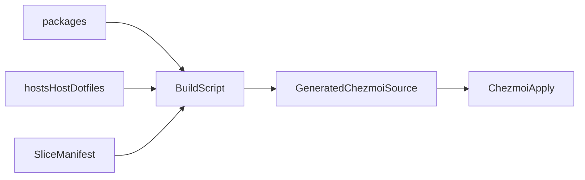

# Chezmoi Canonical Source Model

## Purpose

This document defines how chezmoi integrates with the repository without replacing the canonical user-state source trees.

## Canonical rule

Canonical shared user-state content remains in:

- `packages/`

Canonical host-specific user-state content remains in:

- `hosts/<host>/dotfiles/`

`infra/chezmoi/` is not a second canonical content tree.

## Ownership model

`infra/chezmoi/` owns:

- manifests describing which canonical paths feed a slice
- build scripts that stage generated chezmoi source
- cutover rules
- validation rules for generated source

Generated source lives under:

- `infra/chezmoi/generated/<host>/`

That generated tree is rebuildable output.

## Build flow



## Build rules

1. Preserve canonical source contents exactly.
2. Prefer `cp -a` overlay semantics.
3. Do not rewrite package contents to satisfy chezmoi layout.
4. Keep generated or script-owned files out of static cutover unless their owner changes.
5. Use manifest `exclude` entries to remove runtime-owned paths from generated source after directory copies.

Changes inside already-sliced canonical package paths flow into generated source automatically on the next build.

That is a feature of the model, not drift.

## First slice

The first generated-source slice stages:

- `packages/hyprland/.config/hypr`
- `packages/hyprland/.config/waybar`
- `packages/hyprland/.config/walker`
- `packages/hyprland/.config/elephant`
- optional host overlays such as `hosts/<host>/dotfiles/.config/waybar-hosts/<host>`

## Current slice set

The current generated-source build composes multiple manifests.

Current tracked slices are:

- `session-core.manifest`
- `session-shell.manifest`

The current session-shell slice stages:

- `packages/hyprland/.config/autostart`
- `packages/hyprland/.config/clipse`
- `packages/hyprland/.config/swaync`
- `packages/hyprland/.config/swayosd`

Use the verifier after build to confirm required generated paths exist before any cutover:

```bash
./infra/chezmoi/scripts/build-source.sh --host goldendragon
./infra/chezmoi/scripts/verify-generated-source.sh --host goldendragon
./infra/chezmoi/scripts/plan-stow-cutover.sh --host goldendragon
./infra/chezmoi/scripts/cutover-host.sh --host goldendragon
```

## Known non-static files

These need special handling before full cutover:

- `keyboard.local.conf` generated by `scripts/install/setup/keyboard.sh`
- theme-generated files written by theme-manager scripts
- `~/.config/swaync/style.css` merged by theme-manager scripts
- `~/.config/clipse/theme.toml` generated as theme-linked runtime state
- any file still imperatively written by host setup scripts

## Cutover rule

Chezmoi becomes the owner of a user-state path only when:

1. the path is generated from canonical sources
2. no legacy setup script is still rewriting it
3. Stow is no longer the active owner for that migrated path
