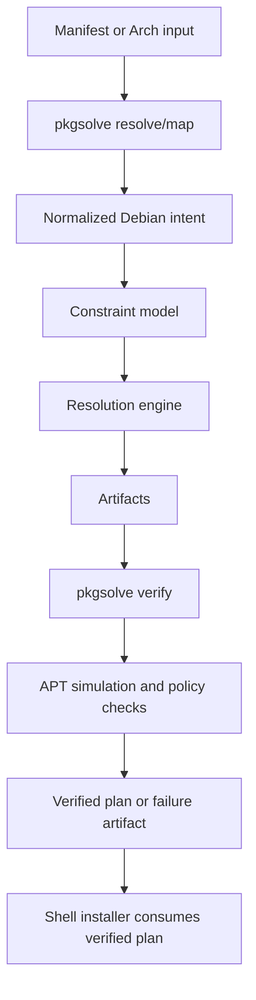

# Architecture Record Document: Debian Resolution Engine

## Status

Accepted design direction for implementation hand-off.

## Scope

This document freezes the major architectural decisions for the Debian satisfiability, verification, and Arch-to-Debian mapping initiative.

## Context Sources

Primary repo context:

- `scripts/install/deps.manifest.toml`
- `scripts/install/install-deps.sh`
- `install.sh`
- `scripts/lib/manifest-toml.sh`
- `README.md`
- `tests/vm/debian-headless/README.md`
- `docs/design/install-elevation.md`

These define the current package intent model, bundle system, adapter-based install flow, and Debian validation scope.

## Decision Summary

The architecture is:

- one compiled Rust binary
- three subcommands: `resolve`, `verify`, `map`
- custom planning layer for Debian package satisfiability
- APT retained as the final verifier
- Arch-to-Debian translation kept outside the install path
- manifest remains the package intent source of truth

## ADR-1: Use Rust

### Decision

Use Rust as the implementation language.

### Why

- no interpreter required at runtime
- strong typing for version, constraint, and artifact models
- suitable for a solver-oriented core
- good fit for producing one portable binary
- safer than shell for complex package reasoning

### Rejected Alternatives

#### Python

Rejected because runtime interpreter dependency is explicitly disallowed.

#### Shell

Rejected because package satisfiability, version comparison, lock modeling, and artifact generation are too brittle in shell.

#### Go

Viable, but not preferred.

Go would be acceptable for a thinner verifier, but Rust is a better fit for:

- dense package model logic
- version comparison semantics
- solver-like core
- future extensibility without silently weak typing the model

## ADR-2: Keep Manifest As Source Of Truth

### Decision

Do not create a parallel package-definition system.

The existing TOML manifest remains the source of package intent.

### Why

This repo already treats `deps.manifest.toml` as the package source of truth. Adding a second package intent format would create drift and duplicated maintenance.

### Consequence

The new tool must ingest:

- manifest + bundle selections
- direct request files
- later lockfile overlays

But it must not replace manifest ownership.

## ADR-3: Separate Planner From Installer

### Decision

The new tool plans and verifies.
APT installs.

### Why

APT is still the real package manager on Debian systems. Replacing it is unnecessary and risky.

The custom tool adds value by:

- failing earlier
- emitting better artifacts
- supporting best-effort resolution
- supporting mapping from Arch package intent

### Consequence

The install path should eventually become:

```text
manifest/bundle input
  -> pkgsolve resolve
  -> pkgsolve verify
  -> apt install from verified plan
```

## ADR-4: Keep Arch-to-Debian Mapping Out Of The Install Path

### Decision

The Arch-to-Debian mapper is a separate tool workflow, not part of the runtime Debian install path.

### Why

Mapping is exploratory and translation-heavy.
Installation is operational and should stay deterministic.

Mixing them would make the Debian install path harder to reason about and harder to verify.

### Consequence

`pkgsolve map` emits Debian artifacts only.
It does not mutate the system.

## ADR-5: Support Best-Effort Mode With Unsatisfied Residue

### Decision

The tool must support both:

- strict satisfiability
- best-effort partial resolution

### Why

The requirement explicitly says:

- proceed with everything that is satisfiable
- clearly output what is not satisfiable

That is not a pure yes/no SAT workflow.

### Consequence

The architecture must support:

- hard constraints
- relaxable goals
- dropped-goal explanations
- explicit unsat artifacts

## ADR-6: Model Package Candidates At Version Granularity

### Decision

The solver model must treat package-version pairs as the primary candidate units.

### Why

This is required for:

- apt versioning
- pinning
- snapshot constraints
- local `.deb` integration
- conflict and dependency reasoning

### Consequence

The model cannot operate only at package-name granularity.

## ADR-7: Make APT The Final Verifier

### Decision

Even after custom solving, the generated plan must still be verified against APT behavior.

### Why

APT has the final say on what is installable in the target environment.

A custom planner is valuable for clarity and explainability, but it should not be treated as a replacement oracle.

### Consequence

`verify` must call into APT simulation and policy inspection.

If custom resolution and APT verification disagree:

- verification wins
- the disagreement is recorded in an artifact

## ADR-8: Snapshots And Pins Are First-Class Constraints

### Decision

Snapshots, lockfiles, and pins are part of the core model, not a later afterthought.

### Why

Reproducibility is one of the main reasons to build this system.

If the universe is not constrained before resolution, then the resulting plan is only weakly meaningful.

### Consequence

The implementation must model:

- repository origin
- snapshot identifier
- exact versions
- pin priority or equivalent origin preference

## ADR-9: Local `.deb` Inputs Are Native Citizens

### Decision

Local `.deb` packages are treated as package sources in the same planning graph, not as an external manual override.

### Why

The stated requirements include support for:

- `.deb`
- apt versioning
- pinning
- snapshots

That only stays coherent if local packages enter the same model with metadata and checksums.

### Consequence

The tool must parse and model:

- package name
- version
- dependencies
- conflicts
- checksum
- path existence

## ADR-10: Emit Stable Artifacts For Every Run

### Decision

Every run emits stable artifacts, even on failure or partial success.

### Why

The point of this system is not just to decide.
It is to explain.

### Required Artifact Classes

- plan artifact
- unsatisfied artifact
- trace artifact
- APT plan artifact
- pin/preferences artifact

## High-Level Architecture



## Bounded Responsibilities

### What `pkgsolve` Owns

- Debian intent normalization
- package universe modeling
- mapping rules
- satisfiability planning
- partial-resolution behavior
- artifact generation
- verification orchestration

### What `install.sh` / `install-deps.sh` Continue To Own

- user-facing shell workflow
- host-specific setup sequencing
- package-manager invocation
- post-install configuration
- secrets and stow orchestration

## Alternatives Rejected

### Build Only An APT Wrapper

Rejected because it would verify too late and provide weak translation support for Arch inputs.

### Build Only A Mapper

Rejected because the Debian path also needs deterministic preflight and verification.

### Reuse APT Alone For All Resolution

Rejected because:

- it does not solve the translation problem
- it does not produce the desired unsat residue artifact cleanly
- it makes best-effort explanation much weaker

## Implementation Order Decision

### Decision

Build verifier-first, then solver, then best-effort relaxations, then mapper.

### Why

This sequence gives usable value earlier and reduces risk.

The implementation agent should not start with the most ambitious solver path before artifact schemas and Debian verification are stable.

## Operational Expectations

When integrated into the Debian path:

- strict mode should fail before install mutation
- best-effort mode should install only the verified satisfiable subset
- unsatisfied residue must be written to disk and printed clearly

## Hand-Off Guidance For The Next Agent

When implementation starts:

1. read the context sources listed above
2. create the Rust binary skeleton
3. define artifact schemas before deep solver work
4. keep shell integration minimal
5. preserve manifest ownership
6. keep the Arch mapper separate from the runtime install path

## Final Architecture Call

This system should be built as a compiled Rust planning-and-verification binary that complements the current installer rather than replacing it.

That is the simplest architecture that satisfies:

- no interpreter dependency
- early and clear Debian failure reporting
- best-effort resolution
- Arch-to-Debian translation
- reproducible artifacts
