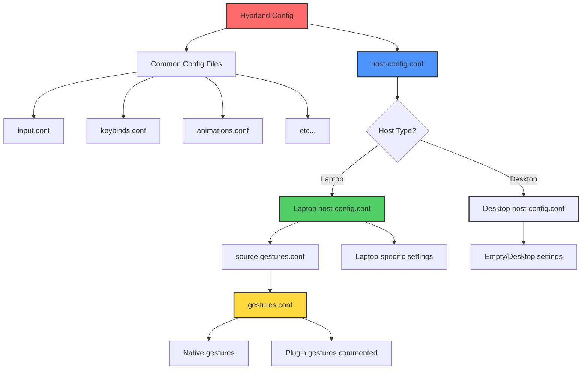

# Host-Specific Gesture Configuration Architecture

## Overview

Touchpad gesture support is now **laptop-specific** and will only be enabled on laptop hosts (firedragon, spacedragon), not desktop hosts (dragon, goldendragon).

## Architecture



## File Structure

### Shared Configuration (All Hosts)

**`packages/hyprland/.config/hypr/hyprland.conf`**:
```ini
# Common configs
source = ~/.config/hypr/config/input.conf
source = ~/.config/hypr/config/keybinds.conf
# ... other common configs ...

# Host-specific config (different per host)
source = ~/.config/hypr/config/host-config.conf  # ← Key line!
```

**`packages/hyprland/.config/hypr/config/gestures.conf`**:
- Contains gesture bindings
- Shared by all laptop hosts
- **NOT sourced directly** by main config
- Only sourced via host-config.conf

**`packages/hyprland/.config/hypr/config/host-config.conf`** (Default):
- Empty placeholder for desktop hosts
- Stowed by default
- Replaced by laptop setup scripts

### Laptop Hosts (FireDragon, Spacedragon)

Laptop setup scripts create `~/.config/hypr/config/host-config.conf`:

**`hosts/firedragon/setup.sh`** creates:
```ini
# FireDragon Laptop-Specific Configuration
source = ~/.config/hypr/config/gestures.conf

# Add other laptop-specific settings here
```

**`hosts/spacedragon/setup.sh`** creates:
```ini
# Spacedragon Laptop-Specific Configuration
source = ~/.config/hypr/config/gestures.conf

# Add other laptop-specific settings here
```

### Desktop Hosts (Dragon, GoldenDragon)

Desktop hosts **do not override** `host-config.conf`, so they use the default empty placeholder.

## How It Works

### 1. Initial State (After Stow)

```
~/.config/hypr/
├── hyprland.conf           # Main config
├── config/
│   ├── input.conf
│   ├── gestures.conf       # Available but not sourced
│   └── host-config.conf    # Empty placeholder
```

**Result**: No gestures on any host (safe default)

### 2. After Laptop Setup (FireDragon)

```bash
cd ~/dotfiles
bash hosts/firedragon/setup.sh
```

Creates/overwrites:
```
~/.config/hypr/config/host-config.conf  # Now sources gestures.conf!
```

**Result**: Gestures enabled on FireDragon only

### 3. Desktop Hosts (Dragon)

No setup script run, so:
```
~/.config/hypr/config/host-config.conf  # Remains empty
```

**Result**: No gestures on desktop (as intended)

## Benefits

### ✅ Clean Separation
- Desktop hosts: No gesture config, no errors
- Laptop hosts: Full gesture support

### ✅ No Code Duplication
- `gestures.conf` shared by all laptop hosts
- Single source of truth for gesture config

### ✅ Extensible
- Add laptop-specific monitor configs
- Add battery-aware window rules
- Add touch screen settings
- All in host-config.conf

### ✅ Safe Defaults
- Default config is empty (no errors)
- Laptop setup explicitly enables features

## Adding New Laptop Host

To add a new laptop host (e.g., `microdragon`):

1. **Create setup script**: `hosts/microdragon/setup.sh`

2. **Add host-config creation**:
```bash
create_host_config() {
    mkdir -p "$HOME/.config/hypr/config"
    
    cat > "$HOME/.config/hypr/config/host-config.conf" << 'EOF'
# MicroDragon Laptop-Specific Configuration
source = ~/.config/hypr/config/gestures.conf

# Add microdragon-specific settings here
EOF
}
```

3. **Call in main**:
```bash
main() {
    # ... other setup ...
    create_host_config
}
```

## Desktop Host Pattern

For desktop hosts, you can optionally create a desktop-specific config:

```bash
# In hosts/dragon/setup.sh
create_host_config() {
    mkdir -p "$HOME/.config/hypr/config"
    
    cat > "$HOME/.config/hypr/config/host-config.conf" << 'EOF'
# Dragon Desktop-Specific Configuration

# Desktop-specific settings (no gestures)
# - Multi-monitor setups
# - Gaming optimizations
# - High-performance settings
EOF
}
```

## Files Modified

### 1. Main Hyprland Config
**File**: `packages/hyprland/.config/hypr/hyprland.conf`
- **Changed**: Added `source = ~/.config/hypr/config/host-config.conf`
- **Removed**: Direct source of gestures.conf

### 2. Default Host Config
**File**: `packages/hyprland/.config/hypr/config/host-config.conf`
- **Created**: Empty placeholder (safe default)
- **Purpose**: Prevent errors on desktop hosts

### 3. FireDragon Setup
**File**: `hosts/firedragon/setup.sh`
- **Added**: `create_host_config()` function
- **Creates**: Laptop-specific host-config.conf with gesture support

### 4. Spacedragon Setup
**File**: `hosts/spacedragon/setup.sh`
- **Added**: `create_host_config()` function
- **Creates**: Laptop-specific host-config.conf with gesture support

## Verification

### Check Current Host Type

```bash
# Check if gestures are enabled
grep -r "gestures.conf" ~/.config/hypr/config/host-config.conf
```

**Laptop output**:
```
source = ~/.config/hypr/config/gestures.conf
```

**Desktop output**: (empty or no match)

### Test Gestures

**Laptops**:
```bash
hyprctl binds | grep gesture
# Should show gesture bindings
```

**Desktops**:
```bash
hyprctl binds | grep gesture
# Should show nothing (no gestures configured)
```

## Troubleshooting

### Desktop Host Showing Gesture Errors

**Problem**: Desktop host trying to use gestures

**Solution**:
```bash
# Ensure host-config.conf is empty or only has desktop settings
cat ~/.config/hypr/config/host-config.conf
# Should NOT contain: source = ~/.config/hypr/config/gestures.conf
```

### Laptop Not Getting Gestures

**Problem**: Laptop setup didn't create host-config.conf

**Solution**:
```bash
# Re-run laptop setup
cd ~/dotfiles
bash hosts/firedragon/setup.sh  # or spacedragon

# Verify
grep gestures ~/.config/hypr/config/host-config.conf
```

### Want to Disable Gestures Temporarily

**Laptop users**:
```bash
# Comment out the source line
sed -i 's/^source = .*gestures.conf/#&/' ~/.config/hypr/config/host-config.conf

# Reload
hyprctl reload
```

## Summary

| Host Type | host-config.conf Content | Gestures? |
|-----------|--------------------------|-----------|
| Desktop (dragon) | Empty (default) | ❌ No |
| Desktop (goldendragon) | Empty (default) | ❌ No |
| Laptop (firedragon) | Sources gestures.conf | ✅ Yes |
| Laptop (spacedragon) | Sources gestures.conf | ✅ Yes |

**Key Concept**: The `host-config.conf` file acts as a **switchboard** that enables/disables features based on host type, all while using shared configuration files.

---

**Status**: ✅ Implemented
**Benefits**: Clean, maintainable, extensible
**Pattern**: Reusable for other host-specific features

