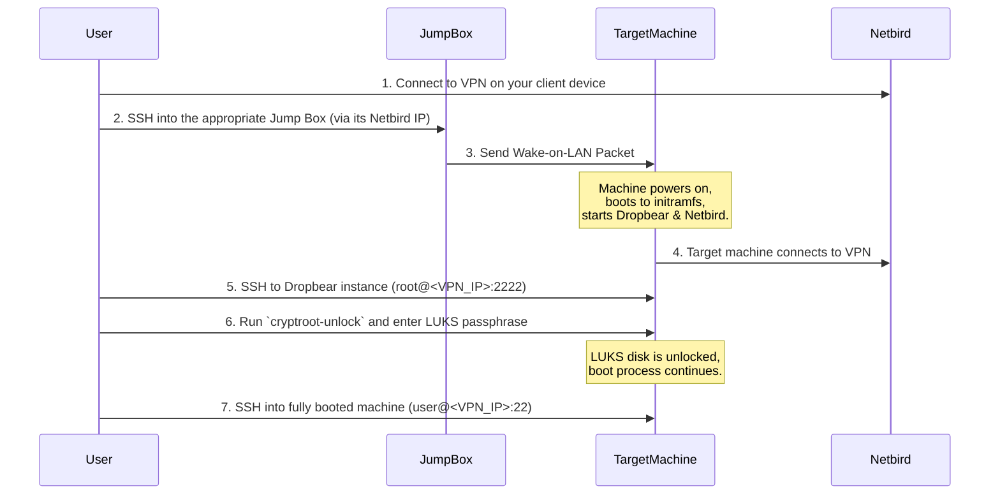

# Remote Access & Infrastructure Guide

This document provides a comprehensive overview of the remote access infrastructure, which is designed for secure, flexible access to all machines across home and work networks. The system leverages Netbird, Wake-on-LAN, and a remote LUKS unlocking mechanism via Dropbear SSH.

## 1. Core Concepts & Architecture

The primary goal is to create a single, unified, and secure network that connects all devices, regardless of their physical location. This is achieved through a mesh VPN, with low-power "jump boxes" acting as always-on relays for tasks like Wake-on-LAN.

### Core Technologies

- **Netbird**: A WireGuard-based mesh VPN that creates a flat, secure network. Each device gets a unique, static IP address, allowing direct, peer-to-peer communication as if all devices were on the same LAN.
- **Wake-on-LAN (WOL)**: A protocol that allows a machine to be powered on by a "magic packet" sent over the network. This enables us to wake up machines that are powered off to save energy.
- **Dropbear SSH in Initramfs**: A lightweight SSH server that is loaded into the initial RAM disk (`initramfs`) during the boot process. This allows us to SSH into a machine _before_ the main operating system and the LUKS-encrypted root filesystem are loaded.
- **Jump Boxes**: Low-power, always-on single-board computers (like a Raspberry Pi or MILK-V Duo) that serve as reliable entry points into a physical network. Their primary roles are to send WOL packets and provide a stable remote presence.

### Architecture Diagram

This diagram illustrates how all hosts are interconnected via the Netbird VPN mesh.

```mermaid
graph TD
    subgraph "Home Network"
        direction LR
        microdragon_pi[microdragon.local<br/>(Raspberry Pi)<br/>Jump Box / Always On]
        dragon_ws[dragon.local<br/>(Arch Workstation)<br/>LUKS Encrypted]
        dragonserver[dragonserver.local<br/>(Proxmox Server)]
    end

    subgraph "Work Network"
        direction LR
        workdragon_mv[workdragon<br/>(MILK-V Duo)<br/>Jump Box / Always On]
        goldendragon_ws[goldendragon.local<br/>(Arch Workstation)<br/>LUKS Encrypted]
    end

    subgraph "Remote User"
        user[Your Laptop<br/>(Any Location)]
    end

    netbird[Netbird VPN Mesh]

    user -- "Netbird VPN" --> netbird
    netbird -- "VPN Tunnel" --> microdragon_pi
    netbird -- "VPN Tunnel" --> dragon_ws
    netbird -- "VPN Tunnel" --> dragonserver
    netbird -- "VPN Tunnel" --> workdragon_mv
    netbird -- "VPN Tunnel" --> goldendragon_ws

    microdragon_pi -- "WOL Packet" --> dragon_ws
    workdragon_mv -- "WOL Packet" --> goldendragon_ws

    classDef jumpbox fill:#f9f,stroke:#333,stroke-width:2px;
    classDef encrypted fill:#f99,stroke:#333,stroke-width:2px;
    class microdragon_pi,workdragon_mv jumpbox;
    class dragon_ws,goldendragon_ws encrypted;
```

## 2. Onboarding a New Encrypted Host

To enable remote unlocking on a new or existing Debian-based machine with LUKS encryption, use the `dropbear-luks-unlock.sh` utility.

### Prerequisites

- The target machine must be Debian-based (e.g., Debian, Ubuntu).
- The target machine must have `dropbear-initramfs`, `netbird`, and `gum` installed.
- You must have `sudo` access on the target machine.
- The machine must already be enrolled in your Netbird network.

### Steps

1.  **Clone the `dotfiles` Repository**:
    Ensure the `dotfiles` repository is available on the machine.

2.  **Run the Setup Script**:
    Execute the utility script with `sudo`:

    ```bash
    cd ~/dotfiles
    sudo ./scripts/utilities/dropbear-luks-unlock.sh
    ```

3.  **Follow the Interactive Prompts**:

    - **Select SSH Key**: The script will ask you to choose an SSH public key from your home directory (`~/.ssh/*.pub`). This key will be used to authorize your login to Dropbear.
    - **Provide Netbird Setup Key (Optional)**: If this machine needs a fresh setup key to connect to Netbird during boot, you can provide one. If the machine is already reliably connected, you can skip this.

4.  **Reboot**:
    After the script successfully updates the `initramfs`, reboot the machine to apply the changes.

The host is now configured for remote unlocking.

## 3. Remote Access Workflows

This section details the step-by-step procedures for accessing your machines.

### Workflow: Waking and Unlocking an Encrypted Machine

This is the process for accessing a machine (like `dragon.local` or `goldendragon.local`) that is powered off.

#### Workflow Diagram



#### Step-by-Step Instructions

1.  **Connect to the VPN**: Ensure your client device is connected to the Netbird VPN.

2.  **SSH into the Jump Box**:

    - To wake a **home** machine, connect to `microdragon.local`.
    - To wake a **work** machine, connect to `workdragon`.
      Use its Netbird IP address.

    ```bash
    # Example for waking a home machine
    ssh user@<microdragon_netbird_ip>
    ```

3.  **Send the WOL Packet**:
    From the jump box, use the `wakeonlan` command with the MAC address of the target machine.

    ```bash
    wakeonlan <MAC_ADDRESS_OF_TARGET_MACHINE>
    ```

4.  **Connect to Dropbear**:
    Wait about 30-60 seconds for the target machine to boot into its `initramfs` and connect to Netbird. Then, SSH into it as `root` on port `2222` using its Netbird IP.

    ```bash
    ssh root@<target_machine_netbird_ip> -p 2222
    ```

5.  **Unlock the LUKS Partition**:
    Once logged into Dropbear, you will see a minimal shell. Run the unlock command:

    ```bash
    cryptroot-unlock
    ```

    You will be prompted to enter your LUKS passphrase. After entering it correctly, the disk will be unlocked, and the machine will continue its boot process. The SSH session will terminate automatically.

6.  **Connect to the Fully Booted Machine**:
    Wait another 30-60 seconds for the machine to finish booting. You can now SSH into it normally using your standard user account on port 22.
    ```bash
    ssh your_user@<target_machine_netbird_ip>
    ```

### Workflow: Accessing an Already-Running Machine

If a machine is already powered on (like `dragonserver` or an already-unlocked workstation), access is much simpler.

1.  **Connect to the VPN**: Ensure your client is connected to Netbird.
2.  **SSH Directly**: Use the machine's Netbird IP to connect directly.
    ```bash
    ssh your_user@<target_machine_netbird_ip>
    ```

## 4. Security Considerations

- **SSH Keys**: The remote unlock system is secured by your SSH key. Protect the private key you use for Dropbear access. Do not use a password-protected key, as you cannot enter the password in the `initramfs` environment.
- **Netbird Security**: Use Netbird's access controls (ACLs) to restrict traffic if needed. For instance, you could limit which devices can communicate with each other on specific ports.
- **Physical Security**: The jump boxes are always-on devices with access to your network. Ensure they are in a physically secure location.
- **MAC Addresses**: While not a high-security secret, avoid exposing the MAC addresses of your machines unnecessarily.
