# FireDragon Laptop Configuration

AMD-powered laptop optimized for mobile performance, battery life, and thermal management.

## Hardware Specifications

- **CPU**: AMD Processor (Zen architecture)
- **GPU**: AMD Radeon Graphics
- **Form Factor**: Laptop (mobile workstation)

## Configuration Overview

FireDragon is configured with comprehensive laptop-specific optimizations:

```mermaid
flowchart TD
    A[FireDragon Setup] --> B[AMD Hardware]
    A --> C[Power Management]
    A --> D[Laptop Features]
    A --> E[Networking]
    
    B --> B1[AMDGPU Driver]
    B --> B2[Vulkan RADV]
    B --> B3[Video Acceleration]
    B --> B4[CoreCtrl GUI]
    
    C --> C1[TLP Power Manager]
    C --> C2[Thermald]
    C --> C3[ACPI Events]
    C --> C4[CPU Frequency Scaling]
    
    D --> D1[Battery Monitoring]
    D --> D2[Touchpad Configuration]
    D --> D3[Brightness Control]
    D --> D4[Laptop Mode Kernel]
    
    E --> E1[NetworkManager]
    E --> E2[Bluetooth]
    E --> E3[NetBird VPN]
    E --> E4[Custom DNS]
    
    style A fill:#ff6b6b,stroke:#333,stroke-width:2px
    style B fill:#4dabf7,stroke:#333,stroke-width:2px
    style C fill:#51cf66,stroke:#333,stroke-width:2px
    style D fill:#ffd93d,stroke:#333,stroke-width:2px
    style E fill:#a78bfa,stroke:#333,stroke-width:2px
```



## Key Features

### 🎨 AMD Graphics Optimization

- **Driver**: Open-source `amdgpu` kernel driver
- **Vulkan**: RADV driver with ACO shader compiler
- **Video Acceleration**: VA-API and VDPAU support
- **Features**:
  - TearFree rendering
  - Variable Refresh Rate (VRR) support
  - Power-efficient DPM (Dynamic Power Management)
  - CoreCtrl GUI for manual tuning

### ⚡ Power Management (TLP)

Comprehensive power profiles optimized for AMD hardware:

**AC Power Profile**:

- CPU Governor: `schedutil`
- CPU Performance: 0-100%
- CPU Boost: Enabled
- GPU Performance: `auto`
- Platform Profile: `balanced`

**Battery Profile**:

- CPU Governor: `schedutil`
- CPU Performance: 0-50%
- CPU Boost: Disabled
- GPU Performance: `low`
- Platform Profile: `low-power`

### 🔋 Battery Management

- **Monitoring**: Real-time battery status with notifications
- **Thresholds**: Charge limiting (75-80%) to extend battery life
- **Timer**: Systemd timer for periodic battery checks
- **Commands**:
  - `battery` - Show current battery status
  - `power` - Detailed power information via upower

### 🌡️ Thermal Management

- **Thermald**: Automatic thermal control daemon
- **Sensors**: lm_sensors for hardware monitoring
- **Commands**:
  - `temp` - Quick temperature check
  - `thermals` - Live temperature monitoring
  - `fans` - Fan speed status

### 🖱️ Input Devices

**Touchpad Configuration**:

- Tap-to-click enabled
- Natural scrolling (reverse scroll)
- Two-finger scrolling
- Disable while typing
- Adaptive acceleration

**Brightness Control**:

- `brightnessctl` integration
- Hyprland keybindings
- Convenient aliases (`bright-up`, `bright-down`)

### 🌐 Networking

- **WiFi**: NetworkManager with power saving
- **Bluetooth**: Enabled with power management
- **VPN**: NetBird for secure mesh networking
- **DNS**: Custom DNS server (192.168.0.218) with domain routing
- **Commands**:
  - `netbird-status` or `nb` - Check VPN connection
  - `netbird-up` / `netbird-down` - Connect/disconnect VPN
  - `wifi` / `wifi-list` - WiFi management

### 💻 System Optimizations

- **Swappiness**: Reduced to 10 (SSD-friendly)
- **Laptop Mode**: Enabled for disk power savings
- **USB Autosuspend**: Enabled (excludes audio/printers)
- **PCIe ASPM**: Power-saving on battery
- **udev Rules**: Automatic power management for devices

## Installation

Run the FireDragon setup from the dotfiles root:

```bash
cd ~/dotfiles
./setup.sh --host firedragon
```

Or run the host-specific setup directly:

```bash
cd ~/dotfiles/hosts/firedragon
bash setup.sh
```

## Post-Installation

After running setup, complete these steps:

1. **Reboot** to apply all kernel modules and power management changes

2. **Configure Sensors**:

   ```bash
   sudo sensors-detect
   # Answer YES to all prompts
   ```

3. **Check TLP Status**:

   ```bash
   tlp-stat
   tlp-stat -b  # Battery info
   tlp-stat -t  # Temperature
   ```

4. **Fine-tune AMD Settings**:
   - Launch `corectrl` from application menu
   - Create custom profiles for performance/quiet modes
   - Enable auto-start if desired

5. **Test Battery Monitoring**:

   ```bash
   battery-status
   systemctl --user status battery-monitor.timer
   ```

6. **Verify Hardware Acceleration**:
7. **Update Firmware & ASUS EC Tools**:

   - Check for BIOS/EC updates on the ASUS support site and flash the latest release before relying on suspend.
   - Install the control utilities (the setup script does this automatically):

     ```bash
     sudo pacman -S --needed asusctl asus-nb-ctrl
     sudo systemctl enable --now asusd.service
     asusctl profile -n Balanced
     ```

8. **Confirm Sleep State**:

   ```bash
   cat /sys/power/mem_sleep
   ```

   - If `deep` is available (e.g. `s2idle [deep]`), add `mem_sleep_default=deep` via `~/dotfiles/hosts/firedragon/fix-acpi-boot.sh` and reboot.
   - If only `s2idle` is exposed (current default), keep it and rely on the runtime-PM override script (`/etc/systemd/system-sleep/99-runtime-pm.sh`) that forces NVMe/Wi-Fi/USB controllers to `power/control=on` before the system enters Modern Standby.

9. **Verify Hardware Acceleration**:

   ```bash
   vainfo  # Check VA-API
   vdpauinfo  # Check VDPAU
   ```

## Quick Reference Commands

### Power Management

```bash
battery             # Show battery status
powersave          # Switch to battery profile
powerperf          # Switch to performance profile
tlpstat            # Detailed TLP status
laptop-mode        # Alias for powersave
performance-mode   # Alias for powerperf
```

> 💡 **Battery behavior**: FireDragon runs in a balanced mode while unplugged (CPU max ≈ 80%, Wi-Fi left in auto). When the battery falls below 30%, the `battery-monitor` helper automatically switches `asusctl` to the Quiet profile for extra runtime; it jumps back to Balanced once the charge recovers above ~35% or you plug in.

### AMD GPU Monitoring

```bash
gpuinfo            # Launch radeontop
gpumon             # Live GPU monitoring
gputemp            # GPU temperature
gpufreq            # GPU clock speeds
```

### System Monitoring

```bash
temp               # CPU temperatures
thermals           # Live thermal monitoring
fans               # Fan speeds
cpufreq            # CPU frequencies
sysinfo            # Quick system overview
```

### Brightness Control

```bash
bright             # Direct brightnessctl
bright-up          # Increase brightness
bright-down        # Decrease brightness
bright-max         # Set to 100%
bright-min         # Set to 10%
```

### Network

```bash
wifi               # WiFi management
wifi-list          # List available networks
wifi-connect SSID  # Connect to network
bluetooth          # Bluetooth control
```

## Environment Variables

FireDragon automatically sets these environment variables:

```bash
# Laptop identification
LAPTOP_MODE=true
POWER_PROFILE=balanced  # or "ac" / "battery"

# AMD-specific
GPU_VENDOR=AMD
GPU_DRIVER=amdgpu
RADV_PERFTEST=aco              # ACO shader compiler
AMD_VULKAN_ICD=RADV            # RADV Vulkan driver
LIBVA_DRIVER_NAME=radeonsi     # VA-API driver
VDPAU_DRIVER=radeonsi          # VDPAU driver
```

## Configuration Files

### System Configuration

- `/etc/tlp.d/01-firedragon.conf` - TLP power management
- `/etc/X11/xorg.conf.d/20-amdgpu.conf` - AMD GPU config
- `/etc/X11/xorg.conf.d/30-touchpad.conf` - Touchpad settings
- `/etc/modprobe.d/amdgpu.conf` - AMD kernel module options
- `/etc/sysctl.d/99-laptop-*.conf` - Kernel parameters
- `/etc/udev/rules.d/50-powersave.rules` - Device power management
- `/etc/polkit-1/rules.d/90-corectrl.rules` - CoreCtrl permissions
- `/etc/systemd/resolved.conf.d/dns.conf` - DNS configuration

### User Configuration

- `~/.config/zsh/functions/firedragon.zsh` - Shell aliases and environment
- `~/.local/bin/battery-status` - Battery status script

## Troubleshooting

### ⚠️ Lid Close Causes System Freeze on Resume

**SYMPTOMS**: Closing the laptop lid causes suspend, but opening it results in a frozen screen requiring hard reboot. However, manual suspend (`systemctl suspend`) and locking work fine.

**ROOT CAUSE**: Missing `amdgpu-console-restore.service` that reinitializes the framebuffer after resume.

**QUICK FIX** (automated):
```bash
cd ~/dotfiles/hosts/firedragon
./fix-lid-close-freeze.sh
# Then reboot when prompted
```

**After reboot, verify:**
```bash
~/dotfiles/hosts/firedragon/verify-suspend-fix.sh
```

**Then test lid close:**
- Close laptop lid for 5+ seconds
- Open lid
- Screen should restore properly without freeze ✅

**Full Documentation**: `docs/LID_CLOSE_FREEZE_FIX.md`

---

### ⚠️ General Suspend/Resume & TTY Issues
- Double-check firmware/EC versions and re-run `asusctl profile -n Balanced` after every BIOS update.
- If the display still fails to return from s2idle, test with the latest LTS kernel and inspect `/etc/systemd/system-sleep/99-runtime-pm.sh` to ensure the NVMe/Wi-Fi paths match `lspci -nn`.

**Suspend/Resume Fix (Recommended)**:
```bash
cd ~/dotfiles/hosts/firedragon
./fix-lid-close-freeze.sh
# Then reboot when prompted
```

**After reboot, verify:**
```bash
~/dotfiles/hosts/firedragon/verify-suspend-fix.sh
```

**Full Documentation**: `docs/SUSPEND_RESUME_COMPLETE_FIX.md`

---

### 💤 Hibernate Not Available / Does Not Resume

If `systemctl hibernate` fails, or SDDM doesn’t show a hibernate button, you usually need **disk-backed swap + resume kernel params + initramfs resume hook**.

**Enable hibernate (automated):**

```bash
cd ~/dotfiles/hosts/firedragon
bash ./enable-sleep-hibernate.sh
reboot
```

After reboot:

```bash
~/dotfiles/hosts/firedragon/verify-suspend-fix.sh
systemctl hibernate
```

### Battery Not Detected

Check if battery path exists:

```bash
ls /sys/class/power_supply/BAT*
# If BAT1 instead of BAT0, update scripts accordingly
```

### TLP Conflicts

Ensure power-profiles-daemon is masked:

```bash
sudo systemctl mask power-profiles-daemon.service
sudo systemctl enable tlp.service
```

### AMD GPU Issues

Check kernel module:

```bash
lsmod | grep amdgpu
dmesg | grep amdgpu
```

Verify Vulkan:

```bash
vulkaninfo | grep -i radeon
```

### Touchpad Not Working

Verify libinput driver:

```bash
xinput list
libinput list-devices
```

### High Power Consumption

Run power analysis:

```bash
sudo powertop --calibrate  # Takes ~15 minutes
sudo tlp-stat -b
```

## Performance Tuning

### Gaming Mode

For maximum performance when plugged in:

```bash
performance-mode
# Or manually:
sudo tlp ac
# Set GPU to high performance in CoreCtrl
```

### Maximum Battery Life

For longest runtime:

```bash
laptop-mode
sudo tlp bat
# Reduce screen brightness
bright-min
```

### Balanced Usage

Default configuration provides good balance:

- Automatic switching based on AC status
- Moderate CPU limits on battery
- GPU power management enabled

## Related Documentation

- [TLP Documentation](https://linrunner.de/tlp/)
- [AMDGPU Driver Wiki](https://wiki.archlinux.org/title/AMDGPU)
- [CoreCtrl GitLab](https://gitlab.com/corectrl/corectrl)
- [Laptop Mode Tools](https://wiki.archlinux.org/title/Laptop)

## Differences from Desktop Hosts (Dragon/GoldenDragon)

| Feature | FireDragon (Laptop) | Dragon/GoldenDragon (Desktop) |
|---------|---------------------|-------------------------------|
| Power Management | TLP with aggressive battery saving | Power-profiles-daemon, performance focus |
| CPU Governor | schedutil (balanced) | performance |
| GPU Profile | Dynamic (auto/low) | High performance |
| Services | thermald, acpid, battery-monitor | Minimal |
| Input | Touchpad configuration | Desktop peripherals only |
| Networking | WiFi + power saving | Ethernet primary |
| Thermal | Active management | Less aggressive |

## Contributing

When making changes to FireDragon configuration:

1. Test on battery and AC power
2. Verify battery life hasn't regressed
3. Check thermal behavior under load
4. Update this README with new features
5. Test AMD-specific features (Vulkan, video decode)
