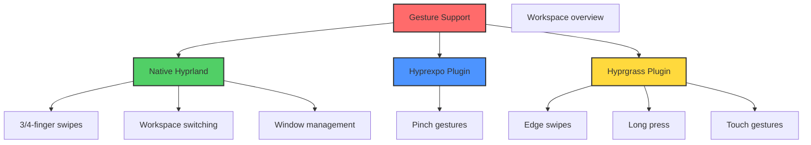

# Advanced Touchpad Gestures Setup - FireDragon

Complete guide for enabling all advanced touchpad and touch gestures in Hyprland.

## Overview

This setup provides three tiers of gesture support:



## Tier 1: Native Hyprland Gestures ✅

**Status**: Always available (built-in)

### Available Gestures

**3-Finger Gestures**:
- Swipe left → Next workspace
- Swipe right → Previous workspace
- Swipe up → Toggle fullscreen
- Swipe down → Minimize window

**4-Finger Gestures**:
- Swipe left/right → Move window between workspaces
- Swipe up → Toggle floating mode
- Swipe down → Close window

**Configuration**: Enabled in `~/.config/hypr/config/gestures.conf`

## Tier 2: Pinch Gestures (Hyprexpo) ✅

**Status**: Built into Hyprland 0.40+

### Available Gestures

**2-Finger Pinch**:
- Pinch out → Show workspace overview
- Pinch in → Return from overview

### Configuration

Already enabled in `gestures.conf`:
```ini
bind = , gesture:pinch:2:o, hyprexpo:expo, toggle
bind = , gesture:pinch:2:i, hyprexpo:expo, toggle
```

### Hyprexpo Plugin Configuration

Enable hyprexpo in your Hyprland config by adding to `~/.config/hypr/config/variables.conf`:

```ini
plugin {
    hyprexpo {
        # Columns and rows for workspace layout
        columns = 3
        gap_size = 5
        
        # Background blur and contrast
        bg_col = rgb(111111)
        workspace_method = center current  # center, first, or center current
        
        # Enable gesture control
        enable_gesture = true  # laptop touchpad
        gesture_fingers = 3    # 3 or 4 fingers
        gesture_distance = 300 # minimum gesture distance
        gesture_positive = true # positive = swipe down
    }
}
```

## Tier 3: Edge Swipes & Touch Gestures (Hyprgrass) 🔧

**Status**: Requires installation (auto-installed by FireDragon setup)

### Available Gestures

**Edge Swipes**:
- Swipe from bottom edge → Open app launcher (walker)
- Swipe from right edge → Toggle notifications
- Swipe from top edge → Toggle waybar

**Long Press**:
- 2-finger long press + drag → Move floating windows
- Long press on window border → Resize

**Touch Gestures**:
- Configurable multi-finger tap actions
- Touch-and-drag support

### Installation

The FireDragon setup script automatically installs hyprgrass:

```bash
cd ~/dotfiles
bash hosts/firedragon/setup.sh
```

**Manual Installation**:
```bash
# Install dependencies
sudo pacman -S glm meson ninja git

# Clone and build
mkdir -p ~/.local/share/hyprland-plugins
cd ~/.local/share/hyprland-plugins
git clone https://github.com/horriblename/hyprgrass.git
cd hyprgrass
meson setup build
ninja -C build

# Plugin will be loaded automatically by autostart script
```

### Configuration

Already enabled in `gestures.conf`:

```ini
plugin {
    touch_gestures {
        sensitivity = 4.0              # Higher = more sensitive
        workspace_swipe_fingers = 3    # Fingers for workspace swipe
        workspace_swipe_edge = ""      # Edge workspace swipe (disabled)
        long_press_delay = 400         # ms for long press
        resize_on_border_long_press = true
        edge_margin = 10               # pixels from edge
        emulate_touchpad_swipe = false
        
        # Edge gestures
        gesture = edge:swipe:u:1, exec, walker
        gesture = edge:swipe:l:1, exec, swaync-client -t
        gesture = edge:swipe:d:1, exec, killall -SIGUSR1 waybar
        gesture = longpress:2, movewindow
    }
}
```

## Complete Gesture Reference

### Native Hyprland (Always Available)

| Gesture | Action |
|---------|--------|
| 3-finger swipe left | Next workspace |
| 3-finger swipe right | Previous workspace |
| 3-finger swipe up | Toggle fullscreen |
| 3-finger swipe down | Minimize to special |
| 4-finger swipe left | Move window to next workspace |
| 4-finger swipe right | Move window to prev workspace |
| 4-finger swipe up | Toggle floating |
| 4-finger swipe down | Close window |

### Hyprexpo (Built-in 0.40+)

| Gesture | Action |
|---------|--------|
| 2-finger pinch out | Show workspace overview |
| 2-finger pinch in | Return from overview |

### Hyprgrass (Requires Installation)

| Gesture | Action |
|---------|--------|
| Swipe from bottom | Launch app drawer (walker) |
| Swipe from right | Toggle notifications |
| Swipe from top | Toggle waybar |
| 2-finger long press + drag | Move floating window |
| Long press on border | Resize window |

## Testing Gestures

### 1. Verify Multi-Touch Support

```bash
libinput list-devices | grep -A 20 Touchpad
```

Look for:
- `Size: [dimensions]`
- `Capabilities: pointer gesture`
- `Tap-to-click: enabled`

### 2. Test Gestures in Real-Time

```bash
sudo libinput debug-events
```

Perform gestures and watch for:
- `GESTURE_SWIPE_BEGIN`
- `GESTURE_SWIPE_UPDATE`
- `GESTURE_PINCH_BEGIN`

### 3. Check Loaded Hyprland Gestures

```bash
hyprctl binds | grep gesture
```

### 4. Verify Plugin Loading

```bash
hyprctl plugin list
```

Should show:
- `hyprgrass` (if installed)
- Built-in plugins including hyprexpo

## Troubleshooting

### Gestures Not Working

**1. Check touchpad capabilities**:
```bash
libinput list-devices
```

**2. Verify Hyprland version**:
```bash
hyprland --version  # Need 0.40+ for pinch gestures
```

**3. Reload configuration**:
```bash
hyprctl reload
```

**4. Check for errors**:
```bash
journalctl --user -u hyprland -n 50
```

### Hyprgrass Plugin Not Loading

**1. Check plugin exists**:
```bash
ls -la ~/.local/share/hyprland-plugins/hyprgrass/build/hyprgrass.so
```

**2. Manually load plugin**:
```bash
hyprctl plugin load ~/.local/share/hyprland-plugins/hyprgrass/build/hyprgrass.so
```

**3. Check plugin errors**:
```bash
hyprctl plugin list
```

**4. Rebuild plugin**:
```bash
cd ~/.local/share/hyprland-plugins/hyprgrass
git pull
ninja -C build clean
meson setup build --wipe
ninja -C build
```

### Edge Swipes Too Sensitive

Edit `~/.config/hypr/config/gestures.conf`:
```ini
plugin {
    touch_gestures {
        sensitivity = 2.0    # Lower value (was 4.0)
        edge_margin = 20     # Larger margin (was 10)
    }
}
```

### Pinch Gestures Not Working

1. Ensure Hyprland 0.40+
2. Enable hyprexpo explicitly:
   ```ini
   plugin {
       hyprexpo {
           enable_gesture = true
           gesture_fingers = 3
       }
   }
   ```

## Customization

### Add Custom Edge Gestures

Edit `~/.config/hypr/config/gestures.conf`:

```ini
plugin {
    touch_gestures {
        # Your custom edge gestures
        gesture = edge:swipe:r:1, exec, your-command-here
        gesture = edge:swipe:l:2, workspace, e+1
    }
}
```

**Edge directions**:
- `u` = up (swipe from bottom)
- `d` = down (swipe from top)
- `l` = left (swipe from right)
- `r` = right (swipe from left)

### Add Custom Long Press Actions

```ini
plugin {
    touch_gestures {
        gesture = longpress:3, exec, your-command
        gesture = longpress:4, togglefloating
    }
}
```

### Adjust Sensitivity

Global sensitivity affects all native Hyprland gestures:
```ini
# In input.conf
input {
    sensitivity = 0.2  # Range: -1.0 to 1.0
    touchpad {
        scroll_factor = 0.5
    }
}
```

Hyprgrass-specific sensitivity:
```ini
# In gestures.conf
plugin {
    touch_gestures {
        sensitivity = 4.0  # Multiplier for hyprgrass gestures
    }
}
```

## Performance Tips

1. **Disable unused gestures**: Comment out gestures you don't use
2. **Adjust sensitivity**: Lower values = less CPU usage
3. **Limit edge margin**: Smaller edge_margin = less area to check

## Files Modified/Created

- `~/.config/hypr/config/gestures.conf` - Gesture configuration
- `~/.config/hypr/config/autostart.conf` - Plugin loading
- `~/.config/hypr/scripts/load-gesture-plugins.sh` - Plugin loader
- `~/.local/share/hyprland-plugins/hyprgrass/` - Plugin source
- `/etc/X11/xorg.conf.d/30-touchpad.conf` - Touchpad settings

## Useful Commands

```bash
# Reload Hyprland config
hyprctl reload

# List loaded plugins
hyprctl plugin list

# Load plugin manually
hyprctl plugin load /path/to/plugin.so

# Unload plugin
hyprctl plugin unload /path/to/plugin.so

# Test touchpad events
sudo libinput debug-events

# Check touchpad capabilities
libinput list-devices

# View gesture bindings
hyprctl binds | grep gesture
```

## Resources

- [Hyprland Gestures Documentation](https://wiki.hypr.land/Configuring/Gestures/)
- [Hyprgrass GitHub](https://github.com/horriblename/hyprgrass)
- [Hyprexpo Documentation](https://wiki.hypr.land/Hypr-Ecosystem/hyprexpo/)
- [libinput Documentation](https://wayland.freedesktop.org/libinput/doc/latest/)

## Support Matrix

| Feature | Native | Hyprexpo | Hyprgrass |
|---------|--------|----------|-----------|
| 3/4-finger swipes | ✅ | ➖ | ✅ |
| Pinch gestures | ➖ | ✅ | ➖ |
| Edge swipes | ➖ | ➖ | ✅ |
| Long press | ➖ | ➖ | ✅ |
| Touch screen | ➖ | ➖ | ✅ |
| Workspace overview | ➖ | ✅ | ➖ |
| Custom commands | ✅ | ➖ | ✅ |

---

**Status**: ✅ Ready to use
**Last Updated**: October 31, 2024
**Hyprland Version**: 0.40+

