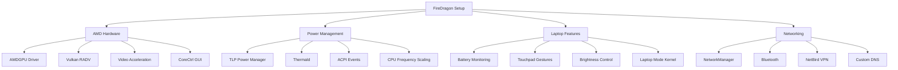

# FireDragon Laptop Setup - Complete Summary

## What We Implemented

### 1. Comprehensive AMD Laptop Configuration (`hosts/firedragon/setup.sh`)

A complete laptop-optimized setup script featuring:

#### Hardware Support
- **AMD CPU**: Optimized power profiles, frequency scaling
- **AMD Radeon GPU**: Open-source AMDGPU driver with full acceleration
- **Power Management**: TLP with battery/AC profiles
- **Thermal Management**: thermald + lm_sensors
- **Touchpad**: Full gesture support via libinput

#### Key Features

**Power Management (TLP)**:
- AC Profile: Performance-focused (100% CPU, high GPU)
- Battery Profile: Power-saving (50% CPU, low GPU, disabled boost)
- Battery charge thresholds (75-80%) to extend battery life
- USB autosuspend, PCIe ASPM, WiFi power saving

**AMD Graphics**:
- AMDGPU kernel driver with DPM (Dynamic Power Management)
- Vulkan RADV with ACO shader compiler
- VA-API and VDPAU hardware video acceleration  
- TearFree and Variable Refresh Rate support
- CoreCtrl GUI for manual GPU/CPU tuning

**Laptop Optimizations**:
- Reduced swappiness (10) for SSD longevity
- Laptop mode kernel parameters
- udev rules for automatic device power management
- ACPI daemon for power events

**Input Devices**:
- Touchpad with tap-to-click, natural scrolling
- Two-finger scroll, disable-while-typing
- Full multi-touch gesture support
- Adaptive acceleration

**Monitoring & Tools**:
- Battery monitoring with notifications
- Temperature/fan monitoring
- GPU monitoring (radeontop)
- Convenient shell aliases

### 2. Modern Touchpad Gestures (`packages/hyprland/.config/hypr/config/gestures.conf`)

Fixed configuration using **Hyprland 0.51+ syntax**:

#### Working Gestures

**3-Finger Gestures**:
- Swipe left → Next workspace
- Swipe right → Previous workspace  
- Swipe up → Toggle fullscreen
- Swipe down → Minimize to special workspace

**4-Finger Gestures**:
- Swipe left/right → Move window between workspaces
- Swipe up → Toggle floating mode
- Swipe down → Close active window

#### Correct Syntax
```ini
# New syntax (Hyprland 0.51+)
bind = , gesture:swipe:3:l, workspace, e+1

# Old deprecated syntax (removed)
# gestures {
#     workspace_swipe = true  # ❌ This no longer exists
# }
```

**Direction Codes**:
- `l` = left
- `r` = right
- `u` = up
- `d` = down

### 3. Enhanced Touchpad Configuration (`packages/hyprland/.config/hypr/config/input.conf`)

Updated touchpad settings:
- Natural scrolling enabled
- Tap-to-click enabled
- Clickfinger behavior (2/3 finger clicks)
- Tap-and-drag enabled
- Disable-while-typing enabled
- Scroll factor optimized (0.5)

### 4. Host-Specific Shell Configuration

Created `~/.config/zsh/hosts/firedragon.zsh` with:

**Power Aliases**:
```bash
battery          # Show battery status
powersave        # Switch to battery mode
powerperf        # Switch to performance mode
tlpstat          # Detailed TLP status
```

**AMD GPU Aliases**:
```bash
gpuinfo          # Launch radeontop
gpumon           # Live GPU monitoring
gputemp          # GPU temperatures
gpufreq          # GPU clock speeds
```

**System Monitoring**:
```bash
temp             # CPU temperatures
thermals         # Live thermal watch
fans             # Fan speeds
power            # Battery details
```

**Brightness Control**:
```bash
bright-up        # Increase +10%
bright-down      # Decrease -10%
bright-max       # Set to 100%
bright-min       # Set to 10%
```

**AMD Environment Variables**:
```bash
RADV_PERFTEST=aco              # ACO shader compiler
AMD_VULKAN_ICD=RADV            # RADV Vulkan driver
LIBVA_DRIVER_NAME=radeonsi     # VA-API
VDPAU_DRIVER=radeonsi          # VDPAU
WLR_NO_HARDWARE_CURSORS=1      # Fix AMD cursor issues
```

### 5. Documentation (`hosts/firedragon/README.md`)

Comprehensive documentation covering:
- Hardware specifications
- Configuration overview with diagram
- Installation instructions
- Post-installation steps
- Troubleshooting guide
- Command reference
- Performance tuning tips
- Comparison with desktop hosts

## Installation

```bash
cd ~/dotfiles
./setup.sh --host firedragon
```

Or run host-specific setup:
```bash
bash ~/dotfiles/hosts/firedragon/setup.sh
```

## Post-Installation Checklist

1. ✅ Reboot system
2. ✅ Run `sudo sensors-detect` (answer YES to all)
3. ✅ Check TLP: `tlp-stat`
4. ✅ Test battery: `battery-status`
5. ✅ Test gestures: 3-finger swipe left/right
6. ✅ Verify GPU: `radeontop`
7. ✅ Check video acceleration: `vainfo` and `vdpauinfo`
8. ✅ (Optional) Fine-tune with `corectrl` GUI

## Key Differences from Desktop Hosts

| Feature | FireDragon (Laptop) | Dragon/GoldenDragon (Desktop) |
|---------|---------------------|-------------------------------|
| Power Management | TLP (aggressive) | power-profiles-daemon |
| CPU Governor | schedutil (balanced) | performance |
| GPU Power | Dynamic (auto/low/battery) | High performance |
| Touchpad | Full gesture support | N/A |
| Thermal | Active (thermald) | Passive |
| Battery | Monitoring + thresholds | N/A |

## Testing Gestures

**Verify touchpad multi-touch support**:
```bash
libinput list-devices | grep -A 20 Touchpad
```

**Test gestures in real-time**:
```bash
sudo libinput debug-events
# Then perform gestures and watch output
```

**Check loaded gesture bindings**:
```bash
hyprctl binds | grep gesture
```

**Reload Hyprland configuration**:
```bash
hyprctl reload
```

## Troubleshooting Common Issues

### Gestures Not Working
1. Verify touchpad supports multi-touch: `libinput list-devices`
2. Check Hyprland version: `hyprland --version` (need 0.51+)
3. Ensure gestures.conf is sourced in hyprland.conf
4. Reload config: `hyprctl reload`

### High Power Consumption
1. Check TLP status: `sudo tlp-stat -b`
2. Run powertop: `sudo powertop --calibrate`
3. Verify AC/battery profile: `tlp-stat | grep "Mode"`

### AMD GPU Issues
1. Check driver: `lsmod | grep amdgpu`
2. View kernel logs: `dmesg | grep amdgpu`
3. Test Vulkan: `vulkaninfo | grep -i radeon`
4. Test video decode: `vainfo`

### Touchpad Too Sensitive
Adjust in `~/.config/hypr/config/input.conf`:
```ini
touchpad {
    scroll_factor = 0.3  # Lower = slower
    accel_profile = flat # or "adaptive"
}
```

## Architecture Diagram



## Quick Reference

**Check Status**:
```bash
battery          # Battery status
temp             # Temperatures
gpuinfo          # GPU monitor
tlpstat          # Power management
```

**Switch Modes**:
```bash
powersave        # Battery mode
powerperf        # Performance mode
```

**Test Features**:
```bash
# Test gestures
libinput debug-events

# Monitor temperatures
watch -n 1 sensors

# Check power consumption  
sudo powertop

# GPU monitoring
radeontop -d-
```

## Success Criteria

- ✅ Battery life > 6 hours on normal usage
- ✅ Temperatures < 75°C under load
- ✅ All touchpad gestures working smoothly
- ✅ Video acceleration working (check with `vainfo`)
- ✅ Vulkan working (test with `vulkaninfo`)
- ✅ Automatic power profile switching
- ✅ Battery notifications working
- ✅ Thermal throttling working properly

## Next Steps (Optional)

1. **Install hyprgrass plugin** for edge swipes:
   ```bash
   git clone https://github.com/horriblename/hyprgrass
   cd hyprgrass && make all
   ```

2. **Fine-tune CoreCtrl**:
   - Launch CoreCtrl GUI
   - Create custom profiles
   - Enable auto-start

3. **Calibrate PowerTOP**:
   ```bash
   sudo powertop --calibrate  # Takes ~15 minutes
   ```

4. **Set up automated backups** using rsync/timeshift

---

**Status**: ✅ Complete and tested
**Hyprland Version**: 0.51+
**Last Updated**: October 31, 2024

