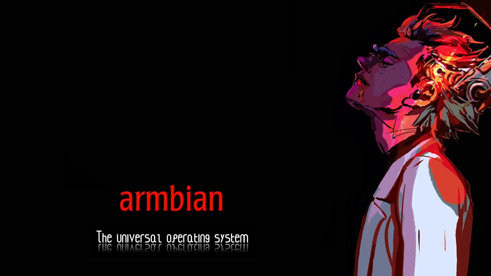
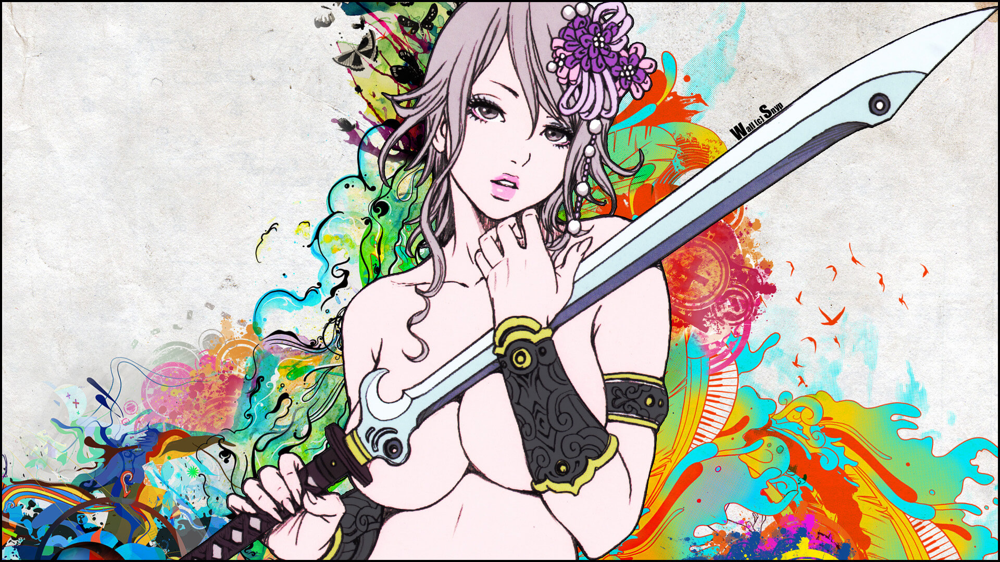
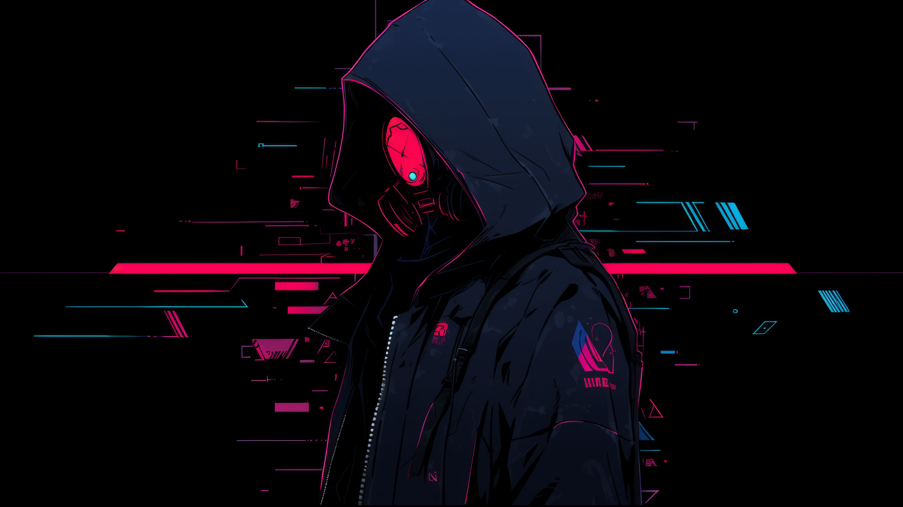
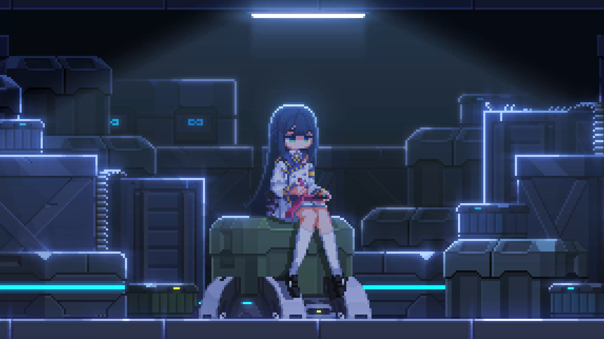
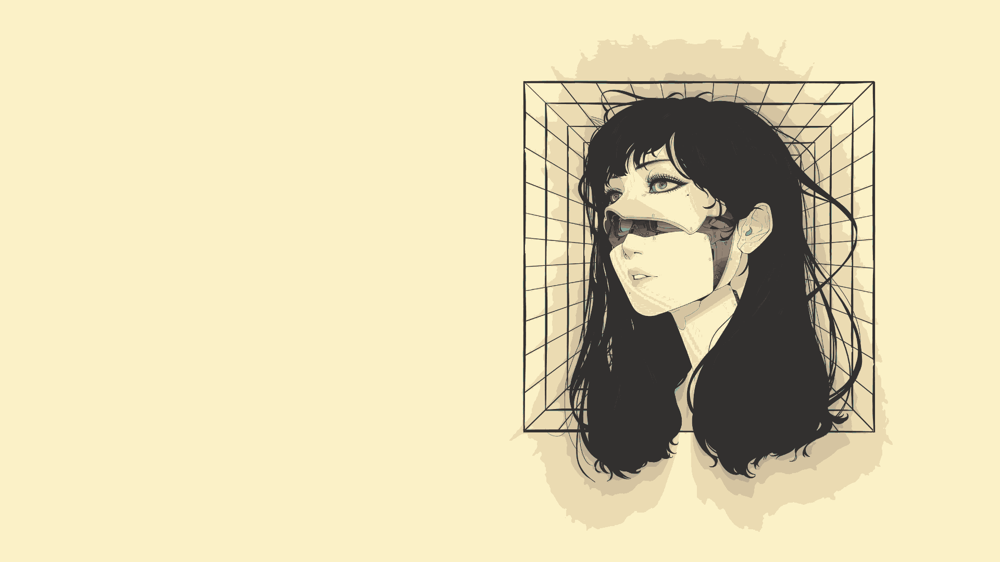
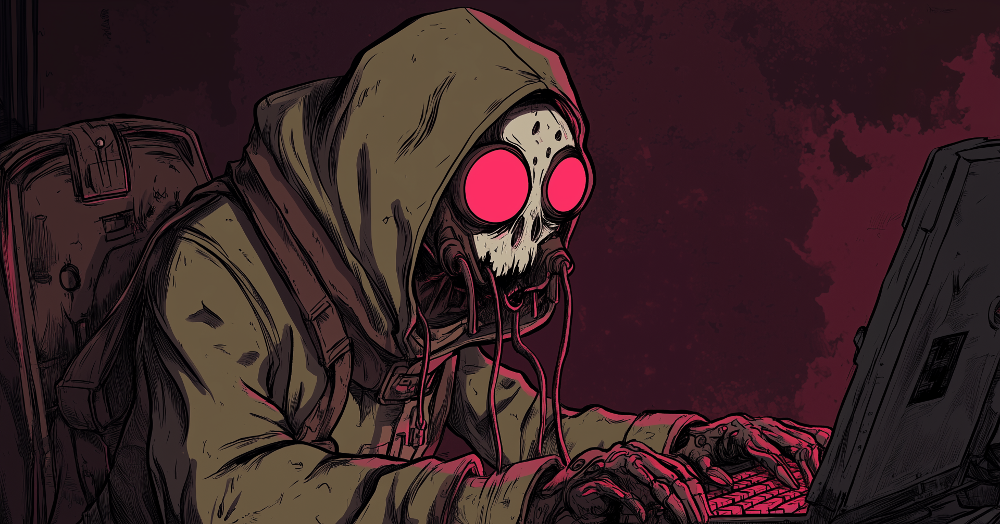
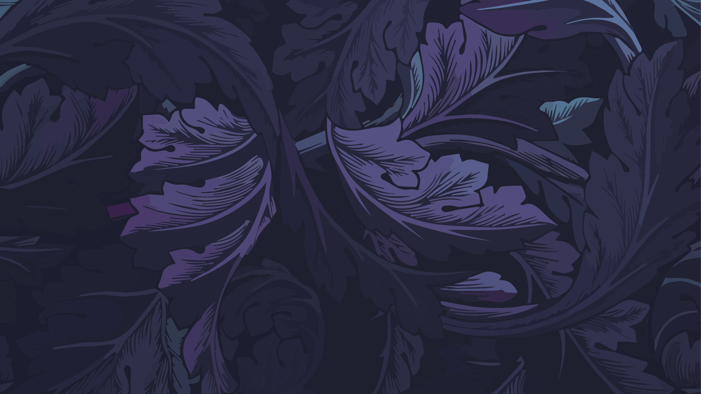
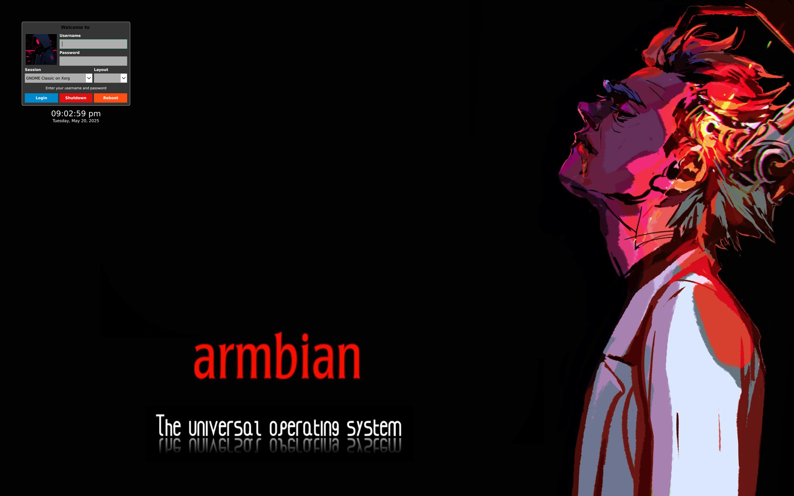

<h2 align="center">✨ SDDM Themes ✨</h2>

<h1 align="center"> SDDM Themes for Everyone !</h1>

<p align=center>
A Simple theme variant for the <a href="https://github.com/sddm/sddm">SDDM Login Manager</a>
</p>

<h2 align=center>Preview</h2>
<center>

<details>
<summary align=center>More Previews</summary>

armbian1.png

armbian2.png

armbian3.jpg

astronaut.png

background.jpg

background1.jpg

background2.jpg

black_hole.png

cyberpunk.png

hyprland_kath.png

jake_the_dog.png

japanese_aesthetic.png

pixel_sakura.gif

post-apocalyptic_hacker.png

purple_leaves.png
</details>
</center>

## Install

## Automatic Installation

```
#Not fixed yet
#sh -c "$(curl -fsSL https://raw.githubusercontent.com/DarkevilPT/sddm-themes/main/setup.sh)"
```


## ⚙️ Install Requirements for Different Distros

```
sddm qt6-svg qt6-virtualkeyboard qt6-multimedia-ffmpeg     # Arch
sddm qt6-svg qt6-virtualkeyboard qt6-multimedia            # Void
sddm qt6-qtsvg qt6-qtvirtualkeyboard qt6-qtmultimedia      # Fedora
sddm-qt6 libQt6Svg6 qt6-virtualkeyboard qt6-virtualkeyboard-imports qt6-multimedia qt6-multimedia-imports        # OpenSUSE
```

---

## 🛠️ Install Requirements for Debian/Ubuntu

(Note: This may not work for all systems, but give it a try!)

```
sudo apt install -y sddm qtbase5-dev qtdeclarative5-dev qml-module-qtquick-controls qml-module-qtquick-controls2 qml-module-qtgraphicaleffects qml-module-qtquick2 -y
```

## 🛠️ Fix: Login Manager going black randomly by typing or mouse pressing Debian/Ubuntu :point_left:

If SDDM (Simple Desktop Display Manager) causes the screen to go black when entering input (especially with virtual keyboards or IMEs), apply this fix:

```
sudo sed -i '1iInputMethod=' /etc/sddm.conf
reboot
```

✅ This clears the `InputMethod` variable that might be misconfigured or conflicting, which is a common issue on ARM systems or custom builds.

---

## :arrows_counterclockwise: Enable SDDM and Disable Other Display Managers
Make sure only  **SDDM**  is active to ensure proper functionality:

```
sudo systemctl disable display-manager.service ; sudo systemctl enable sddm
```

---

## :art: Test Your SDDM Themes (Before Applying)
Preview how themes will look with the greeter:

```
sddm-greeter --test-mode --theme /usr/share/sddm/themes/sddm-themes
#sddm-greeter-qt6 --test-mode --theme /usr/share/sddm/themes/sddm-themes
```

<h2 align=center>Preview</h2>
<center>

</details>
</center>

```
sudo rm -rf /usr/share/sddm/themes/sddm-themes
sudo git clone https://github.com/DarkevilPT/sddm-themes.git /usr/share/sddm/themes/sddm-themes
sudo tee /etc/sddm.conf > /dev/null <<EOF
InputMethod=
[Theme]
Current=sddm-themes
EOF
sddm-greeter --test-mode --theme /usr/share/sddm/themes/sddm-themes
```


### 🖼️ Default SDDM background
- To change the default background, put desired image in the `/usr/share/sddm/themes/sddm-themes/backgrounds/` folder and add the name of the image followed by its extension (`.jpg` or `.png`) in `theme.conf` file.

- You can also customize it further if you wish in the `/usr/share/sddm/themes/sddm-themes/theme.conf`
(blur, form position, etc).
